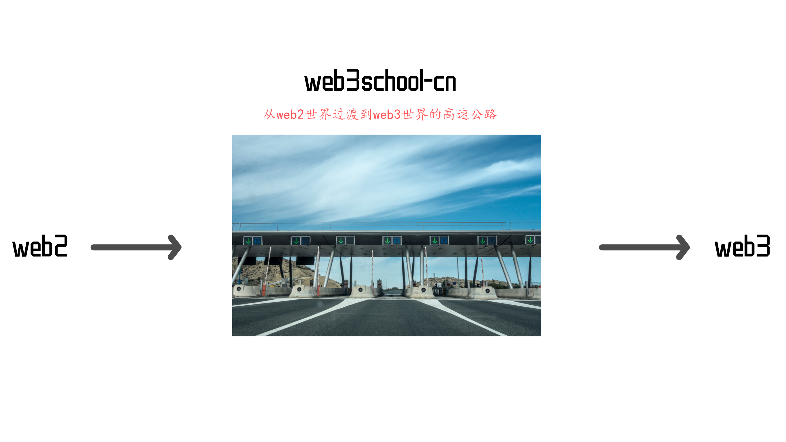

# white-paper

**版本：alpha-0.0.1**

### 一.项目终极目标

依据智能合约不断自我成长的一个去中心化web3学习交流平台

### 二.项目解释

国内并没有正规的web3技术学习平台，可能也是因为这是新兴技术，又或许国家对区块链技术的监管政策；但是技术还是要学习的，不能闭关锁国，如果国外在web3方面远超我们，那我们国家将会处于被动。

互联网的红利已经逐渐疲软，如果我们能抓住新的红海机会，那将会带来丰厚的收益。

目前中国国内并没有web3的学习平台，交流平台，共建平台，而任何一项技术从0-1肯定需要这么一个中间机构，与其去参与区块链中各种不确定的项目，不如去做web2到web3的快速过渡平台（具有学习，交流，共建等能力）。

本平台采用中心化国内私有链的方式进行，暂时不上公链（因为监管），共识机制暂时采用POW；网站的创建维护都采用DAO非中心化组织结构，由成员自主发起，根据某项标准获得对应积分；网站内容也不由管理者创建，而是非中心化的由所有成员提交，依据固定框架进行分类汇总，提交的内容依据其影响力获得积分；上述所有内容都基于初版白皮书，而白皮书也可以不断进行完善优化，完善后的白皮书可以更改上述所有内容，完善白皮书内容也会得到积分（具体奖励规则见下一项说明）。

使用本平台你可以是内容生产者，也可以是学习者，本平台的所有信息价值都按照web3的标准属于你自己，你的信息的影响程度直接决定了你的积分（后面就是你的token）的多少。

后续本平台可以进行商业化的部分：

1. 学习某些课程，需要消耗积分
2. 广告
3. 课程抽成
4. 其他

### 三.激励机制

- 发布信息获得区块链认证的积分，此积分暂时不是token，
- 补全栏目获得积分
- 组织和分享获得积分
- 其他...

### 四.机构划分（DAO）

1. 白皮书·组织
2. 激励机制·组织
3. 共识机制·组织
4. 技术实现·组织
5. 其他·组织

### 五.web2还是web3

虽然本项目是让人们更快进入到web3的一个平台，采用DAO的组织架构进行自我完善，但是受限于国家政策，无法全面web3化，所以本项目前期肯定是一个web2的项目，具有一些国家允许范围内的web3的性质；后续会根据国家政策不断的与时俱进，不断调整。

### 六.在目前监管下如何实践想法

中国目前对区块链监管非常严格，不允许发币。对于流动性这里，目前应用为上链的积分，如果后续监管放松，这里的积分会空投为具体的token。

### 七.加入组织

